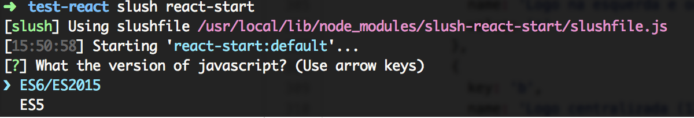

# Slush React Start

> Generator for React + ES5 (Browserify) or ES6 (Webpack/Babel)

## How to install and use the generator?

Install the slush:

```sh
$ [sudo] npm install -g slush
```

Install the tangerine generator:

```sh
$ [sudo] npm install -g slush-react-start
```

Use the generator:

```sh
$ slush react-start
```

Choose your javascript version for  and answer the questions!



## If your choice is ES5:

> React + Browserify

Requirements:

```sh
$ [sudo] npm install -g browserify
$ [sudo] npm install -g watchify
```

Syntax:

```js
var React    = require('react'),
    ReactDOM = require('react-dom');

var Layout = React.createClass({
  render: function(){
    return (
        <h1>Hello</h1>
    )
  }
});

ReactDom.render(<Layout/>, document.getElementById('app'));
```

Folders structure:

	.
	├── README.md
	├── package.json
	├── src/
	|   ├── index.html
	|   ├── app.js
	|   └── bundle.js
	└── .gitignore

Run your project:

```sh
$ npm start
```

Open `[http://localhost:5000](http://localhost:5000)` in your browser =] 

## If your choice is ES6:

> React + Webpack + Babel

Requirements:

```sh
$ [sudo] npm install -g webpack
```

Syntax:

```js
import React from "react";
import ReactDom from "react-dom";

class Layout extends React.Component {
  render() {
    return (
      <h1>Hello</h1>
    );
  }
};

ReactDom.render(<Layout/>, document.getElementById('app'));
```

Folders structure:

	.
	├── README.md
	├── package.json
	├── webpack.config.js
	├── src/
	|   ├── index.html
	|   ├── app.min.js
	|   └── app.js
	└── .gitignore

Run your project:

```sh
$ npm start
```

Go to: `http://localhost:8080/`

## Versioning

To keep better organization of releases we follow the [Semantic Versioning 2.0.0](http://semver.org/) guidelines.

## Contributing

Find on our [roadmap](https://github.com/afonsopacifer/slush-react-start/issues/1) the next steps of the project ;)
<br>
Want to contribute? [Follow these recommendations](https://github.com/afonsopacifer/slush-react-start/blob/master/CONTRIBUTING.md).

## History

See [Releases](https://github.com/afonsopacifer/slush-react-start/releases) for detailed changelog.

## License

[MIT License](https://github.com/afonsopacifer/slush-react-start/blob/master/LICENSE.md) © [Afonso Pacifer](http://afonsopacifer.com/)
